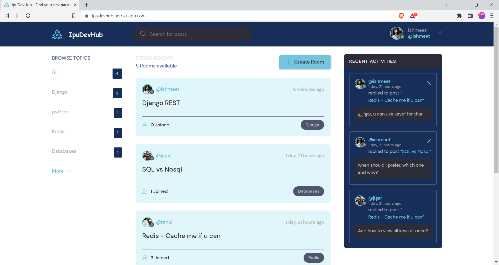
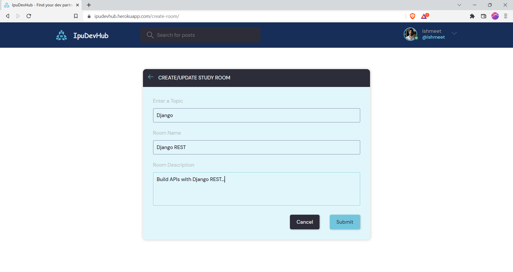
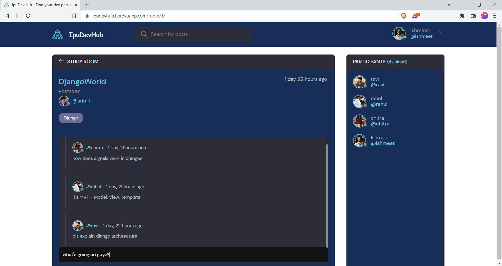
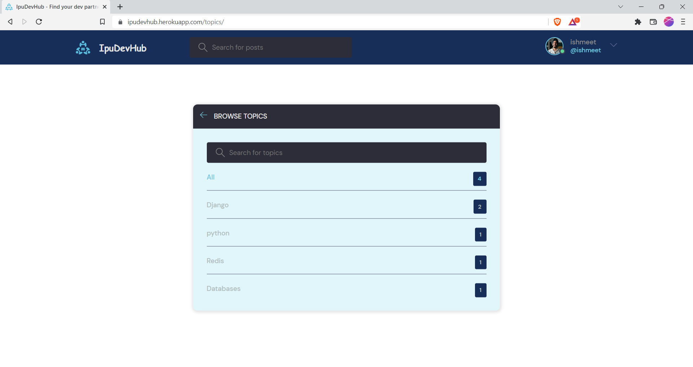

# IpuDevHub

**Problem Statement:** Being a student developer, we want to explore as much as possible about different tech stacks, different domains, subjects etc. For that, we associate ourselves with some community of similar interests which can either be a whatsapp group, discord channel, telegram, reddit and a lot more.. And managing all these becomes a little cumbersome. **So, is there any solution to it?**

**My Approach:** I have experienced it myself during the college life, handling all those different groups and being updated with all of them across different platforms had become very difficult for me. So, while learning web development, I thought of developing something which could solve this problem and I could also learn something out of it. So, I developed  **IpuDevHub** where all Ipu University (my undergrad university) students could interact and learn from each other on one platform avoiding distractions, other channels, groups and platforms while learning. **Live at - [Heroku](https://ipudevhub.herokuapp.com/)**.

## Features Included
  - Creating a separate room for any topic of your interest
  - Browsing the most popular topics
  - Joining multiple rooms
  - showing recent activities on the platform
  - searching, chatting, authentication and a lot more...

## Getting Started 
1. Fork this repository
2. Set up a new virtual environment
3. Clone this repository
4. Change into the project directory and install the project dependency by running `pip install -r requirements.txt`
5. Run the project locally by `python manage.py runserver`.

## Some snippets of the project:

### Home page:

  
### Profile page:

  
### Creating a room:

  
### Join Discussion:

  
## Browse Topics:

                                                                                             And many more...
